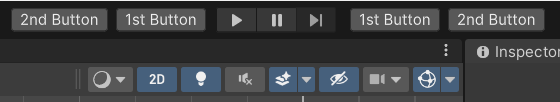
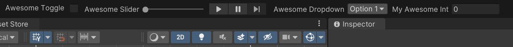

# Unity Toolbar Extender UI Toolkit

Inspired on marijnz's great [Unity Toolbar Extender](https://github.com/marijnz/unity-toolbar-extender), Unity Toolbar Extender UI Toolkit allows you to extend Unity's main toolbar using Unity's UI Toolkit.

- [Getting Started](#getting-started)
    - [Create Common Controls](#create-common-controls)
    - [Place Them Left or Right to Play Buttons](#place-them-left-or-right-to-play-buttons)
    - [Arrange Them](#arrange-them)
    - [Create More Things Than Only Buttons](#create-more-things-than-only-buttons)
    - [Create Whatever Visual Element You Want](#create-whatever-visual-element-you-want)
    - [Don't Worry About Horizontal Space. It's Scrollable!](#dont-worry-about-horizontal-space-its-scrollable)
- [Group Your Elements to Save Space](#group-your-elements-to-save-space)
    - [Configure a Group Definition](#configure-a-group-definition)
        - [Properties](#properties)
- [Hide Unity's Native Toolbar Visual Elements. Save Even More Space](#hide-unitys-native-toolbar-visual-elements-save-even-more-space)
- [MainToolbar Class](#maintoolbar-class)
- [Important Technical Information](#important-technical-information)
    - [About Main Toolbar Elements](#about-main-toolbar-elements)
    - [About Groups](#about-groups)
    - [About MainToolbar Class](#about-maintoolbar-class)
    - [About MainToolbarAutomaticExtender Class](#about-maintoolbarautomaticextender-class)
    - [About Hiding Visual Elements](#about-hiding-visual-elements)
    - [About How This Package Saves Its Data](#about-how-this-package-saves-its-data)
- [Styling Your Main Toolbar Elements](#styling-your-main-toolbar-elements)
- [IntegerField, FloatField and TextField Are Exceptions](#integerfield-floatfield-and-textfield-are-exceptions)
- [Eligible Classes for Recommended Style Application](#eligible-classes-for-recommended-style-application)
- [Install](#install)
    - [Via NPM](#via-npm)
    - [Via OpenUPM](#via-openupm)
    - [Via Git URL](#via-git-url)
- [License](#license)


# Getting Started

## Create Common Controls

Inherit from any Unity's built-in visual element, tag it with `MainToolbarElementAttribute` and define an id. You can place the script anywhere in your project.

```csharp
using Paps.UnityToolbarExtenderUIToolkit;
using UnityEngine;
using UnityEngine.UIElements;

[MainToolbarElement(id: "TheAwesomeButton")]
public class MyAwesomeButton : Button
{
    public MyAwesomeButton()
    {
        text = "Awesome Button";
        clicked += () => Debug.Log("Awesome debug");
    }
}
```


## Place Them Left or Right to Play Buttons

```csharp
using Paps.UnityToolbarExtenderUIToolkit;
using UnityEngine.UIElements;

[MainToolbarElement(id: "LeftButton", ToolbarAlign.Left)]
public class MyLeftButton : Button
{
    public MyLeftButton()
    {
        text = "Left Button";
    }
}

[MainToolbarElement(id: "RightButton", ToolbarAlign.Right)]
public class MyRightButton : Button
{
    public MyRightButton()
    {
        text = "Right Button";
    }
}
```


## Arrange Them

Left elements are ordered from right to left. Right elements from left to right.

```csharp
using Paps.UnityToolbarExtenderUIToolkit;
using UnityEngine.UIElements;

[MainToolbarElement(id: "FirstLeftButton", ToolbarAlign.Left, order: 1)]
public class FirstLeftButton : Button
{
    public FirstLeftButton()
    {
        text = "1st Button";
    }
}

[MainToolbarElement(id: "SecondLeftButton", ToolbarAlign.Left, order: 2)]
public class SecondLeftButton : Button
{
    public SecondLeftButton()
    {
        text = "2nd Button";
    }
}

[MainToolbarElement(id: "FirstRightButton", ToolbarAlign.Right, order: 1)]
public class FirstRightButton : Button
{
    public FirstRightButton()
    {
        text = "1st Button";
    }
}

[MainToolbarElement(id: "SecondRightButton", ToolbarAlign.Right, order: 2)]
public class SecondRightButton : Button
{
    public SecondRightButton()
    {
        text = "2nd Button";
    }
}
```



## Create More Things Than Only Buttons

```csharp
using Paps.UnityToolbarExtenderUIToolkit;
using UnityEngine.UIElements;
using System.Collections.Generic;

[MainToolbarElement(id: "AwesomeToggle", ToolbarAlign.Left)]
public class MyAwesomeToggle : Toggle
{
    public MyAwesomeToggle() : base(label: "Awesome Toggle")
    {

    }
}

[MainToolbarElement(id: "AwesomeDropdownField", ToolbarAlign.Right)]
public class MyAwesomeDropdownField : DropdownField
{
    public MyAwesomeDropdownField() : base(
        label: "Awesome Dropdown", 
        choices: new List<string>() { "Option 1", "Option 2"}, 
        defaultIndex: 0)
    {

    }
}

[MainToolbarElement(id: "AwesomeSlider", ToolbarAlign.Left)]
public class MyAwesomeSlider : Slider
{
    public MyAwesomeSlider() : base(
        label: "Awesome Slider", 
        start: 0, 
        end: 100)
    {

    }
}
```



## Create Whatever Visual Element You Want

As long as your class inherits from `VisualElement` class, you can create whatever you want.

```csharp
using Paps.UnityToolbarExtenderUIToolkit;
using UnityEngine.UIElements;

[MainToolbarElement(id: "AwesomeThing")]
public class MyAwesomeWhatever : VisualElement
{
    private Toggle _displaySliderToggle;
    private Slider _slider;

    public MyAwesomeWhatever()
    {
        _displaySliderToggle = new Toggle("Display slider");
        _slider = new Slider(0, 100);

        _displaySliderToggle.labelElement.style.minWidth = 0;

        _slider.style.display = DisplayStyle.None;
        _slider.style.minWidth = 150;

        _displaySliderToggle.RegisterCallback<ChangeEvent<bool>>(OnToggleValueChanged);

        style.minWidth = 300;
        style.flexDirection = FlexDirection.Row;

        Add(_displaySliderToggle);
        Add(_slider);
    }

    private void OnToggleValueChanged(ChangeEvent<bool> eventArgs)
    {
        var displayToggle = eventArgs.newValue;

        if (displayToggle)
            _slider.style.display = DisplayStyle.Flex;
        else
            _slider.style.display = DisplayStyle.None;
    }
}
```


 Note that you can inherit from any built-in visual element, but there are some things you might need to know if you want to use `IntegerField`, `FloatField` or `TextField`. Please check [this section](#integerfield-floatfield-and-textfield-are-exceptions)

## Don't Worry About Horizontal Space. It's Scrollable!


# Group Your Elements to Save Space

Create a **Group Definition** and group any visual element in it. They will be hidden and shown by a dropdown.


## Configure a Group Definition

To create a Group Definition, in Project Window, `Right Click -> Create -> Paps -> Unity Toolbar Extender UI Toolkit -> Group Definition.`

### Properties:

- `GroupId`: Id of the group. Acts as name too.
- `Alignment`: Left or right to play buttons
- `Order`: Order in toolbar. Left side goes from right to left. Right side goes from left to right.
- `ToolbarElementsIds`: The ids of the visual elements you want to add to this group. The order determines the order in which the inner elements will be displayed.

# Hide Unity's Native Toolbar Visual Elements. Save Even More Space

Open the Main Toolbar Control Panel Window. Go to `Paps -> Unity Toolbar Extender UI Toolkit -> Windows -> Main Toolbar Control Panel`.

Hide any toolbar visual element, either Unity's or yours.


# MainToolbar Class

Everything covered in this article until now is managed by `MainToolbarAutomaticExtender` static class. If, by any chance, you don't want to manage your visual elements the way I meant, you can access the `MainToolbar` static class and manipulate Unity's main toolbar and its elements.

You can listen to `OnInitialized` event and apply your changes once initialized. To subscribe to this event you need to subscribe to it before the first editor update. The easiest way is to do it in the static constructor of a class marked with `InitializeOnLoad` attribute. You can also check the `IsAvailable` property to check if it is initialized.

```csharp
using Paps.UnityToolbarExtenderUIToolkit;
using UnityEditor;

[InitializeOnLoad]
public static class MyOwnMainToolbarManager
{
    static MyOwnMainToolbarManager()
    {
        MainToolbar.OnInitialized += DoSomeStuff;
    }

    private static void DoSomeStuff()
    {
        // I do my stuff here
    }
}
```

You can access Unity's toolbar visual elements, like the play buttons container or the left (where the cloud button is) or the right (where the layouts dropdown is).

```csharp
using Paps.UnityToolbarExtenderUIToolkit;
using UnityEditor;
using UnityEditor.Toolbars;

[InitializeOnLoad]
public static class MyOwnMainToolbarManager
{
    static MyOwnMainToolbarManager()
    {
        MainToolbar.OnInitialized += DoSomeStuff;
    }

    private static void DoSomeStuff()
    {
        var myOwnPlayButton = new EditorToolbarButton("My Play Button", 
            () => EditorApplication.EnterPlaymode());

        MainToolbar.PlayModeButtonsContainer.Add(myOwnPlayButton);
    }
}
```

Unity's toolbar gets destroyed when the editor layout changes (through layout dropdown normally). When this happens `MainToolbar` class will try to get the new object. Because of this, any change made to the toolbar goes away, so you'll need to re-apply your changes. To do this, listen to `OnRefresh` event and you can do the same things you did when `OnInitialized` event happened.

#    Important Technical Information   

The following is a list of things I consider you might be interested in if you need to debug or understand how something works in this package:

## About Main Toolbar Elements

- Many Unity built-in visual elements, like `Button` or `DropdownField`, are rendered with a white broken texture when added to the toolbar. This package automatically applies some basic styles that kind of fix this issue. If you are looking to style your visual elements, you should read [Styling Your Main Toolbar Elements](#styling-your-main-toolbar-elements) section.
- You can inherit from any Unity's built-in visual element, but `IntegerField`, `FloatField` and `TextField` need special considerations. Please read [this section](#integerfield-floatfield-and-textfield-are-exceptions) if you want to use them.
- You can define a main toolbar element that inherits from `IMGUIContainer` to render stuff with `IMGUI`. Remember to use `GUILayout.BeginHorizontal` and `GUILayout.EndHorizontal` to render your things in row.

## About Groups:

- Elements inside a group don't have alignment. The `Alignment` property on visual elements marked with `MainToolbarElementAttribute` will be ignored.
- Groups display their inner elements in column.
- The order the inner elements are displayed is determined by the `ToolbarElementsIds` array elements order.

## About MainToolbar Class:

- Visual elements with `MainToolbarElementAttribute` are handled by `MainToolbarAutomaticExtender` static class. Although you could, it's not officially supported to use this feature at the same time that manipulate the `MainToolbar` class.
- Remember that Unity's `real` main toolbar object is destroyed when editor layout changes. Every change made to that object goes away with it. Use `MainToolbar.OnRefresh` event to re-apply your changes.

## About MainToolbarAutomaticExtender Class:

- This is the main manager. Most of the magic happens inside.
- This class **WON'T** do anything, unless you mark at least one type derived from `VisualElement` with `MainToolbarElementAttribute`.
- When this manager initializes it applies some changes to style of native containers of Unity's main toolbar. This means that those containers behave in a way when `MainToolbarAutomaticExtender` is initialized and other way when it is not.

## About Hiding Visual Elements

- `MainToolbarAutomaticExtender` hides visual elements by settings their style property `display` to `Display.None`.
- There are 2 exceptions to the previous rule, Unity's `AccountDropdown` and `CloudButton` elements. These 2 elements can't be hidden by modifying `display` property, so the way this package hides them is by removing them from the hierarchy.

## About How This Package Saves Its Data

- This package uses EditorPrefs and json tool from Newtonsoft. A single EditorPrefs key is used to save a json object and the other classes write to this json object. If you experience some weird behaviour and you suspect it could be this cache data, you can delete it to start over. To do this go to `Paps -> Unity Toolbar Extender UI Toolkit -> Delete Actions -> Delete package related EditorPrefs`.

# Styling Your Main Toolbar Elements

Some common built-in visual elements, like `Button` and `DropdownField` are rendered with a white broken-like texture when added to Unity's native toolbar.

Check this example.


I'm not a UI Toolkit expert, but it seems to happen because Unity's native toolbar is not an editor window.
In [Unity's documentation page about editor window overlays](https://docs.unity.cn/Manual/overlays-custom.html) says:

> You can inherit from any `VisualElement` type and create styling yourself, but toolbar elements require specific styling. It is preferable to inherit from one of these predefined `EditorToolbar` types

I don't know why `toolbar elements require specific styling`, but this might be a hint.

When you click a group element dropdown, the dropdown container displayed is an editor window with a show mode of a popup. This means that your custom elements can be displayed in two different contexts: **Unity's native toolbar and editor window contexts**.

To workaround this issue, `MainToolbarAutomaticExtender` applies some changes to style of most of your custom visual elements when they are in Unity's native toolbar context. Visual elements in a group are left with the default style, the one we all see in any editor window. You can check if your class can be styled by recommended styles in [this list](#eligible-classes-for-recommended-style-application).

Because of this, if you want to style your custom visual elements yourself you should set `MainToolbarElementAttribute` parameter `useRecommendedStyles` to `false`. Otherwise, your overrides might collide with extender's overrides.

```csharp
using Paps.UnityToolbarExtenderUIToolkit;
using UnityEngine.UIElements;

[MainToolbarElement(id: "StyledButton", useRecommendedStyles: false)]
public class MyStyledButton : Button
{
    public MyStyledButton()
    {
        // I change the style of my button here
    }
}
```

# IntegerField, FloatField and TextField Are Exceptions

Please before reading this section, read [this one](#styling-your-main-toolbar-elements) first.

Most of common Unity's built-in visual elements are modified with recommended styles (unless you set `useRecommendedStyles` to `false` in `MainToolbarElementAttribute`) when they are added to Unity's native toolbar hierarchy. But types derived from `IntegerField`, `FloatField` and `TextField` are not modified. Instead, the package provides custom visual elements to replace each one: `IMGUIIntField`, `IMGUIFloatField`, `IMGUITextField`. Their names start with `IMGUI` because they inherit from `IMGUIContainer` and use old `IMGUI` controls. 

These visual elements are pretty simple and lack most of the advanced features their UI Toolkit counterparts have, but they fulfill their most important goal: Render an input field and give the value.

If I find a way to fix `IntegerField`, `FloatField` and `TextField` displays in Unity's native toolbar context, these `IMGUI` fields will become unnecessary.

Of course, if you want to inherit from `IntegerField`, `FloatField` or `TextField` and style them yourself, you absolutely can!

# Eligible Classes for Recommended Style Application

If your custom main toolbar element meets at least one of the following criteria, it will be eligible to be styled with recommended styles:

- Inherits from `Button` and does not inherits from `EditorToolbarButton`
- Inherits from `Toggle` and does not inherits from `EditorToolbarToggle`
- Inherits from `Slider`
- Inherits from `DropdownField`
- Inherits from `IMGUIIntField`
- Inherits from `IMGUIFloatField`
- Inherits from `IMGUITextField`

Remember that you can disable this feature by setting `useRecommendedStyles` to `false` in `MainToolbarElementAttribute` constructor.

# Install

## via npm

Open `Packages/manifest.json` with your favorite text editor. Add a [scoped registry](https://docs.unity3d.com/Manual/upm-scoped.html) and following line to dependencies block:
```json
{
  "scopedRegistries": [
    {
      "name": "npmjs",
      "url": "https://registry.npmjs.org/",
      "scopes": [
        "com.paps"
      ]
    }
  ],
  "dependencies": {
    "com.paps.unity-toolbar-extender-ui-toolkit": "1.0.0"
  }
}
```
Package should now appear in package manager.

## via OpenUPM

The package is also available on the [openupm registry](https://openupm.com/packages/com.paps.unity-toolbar-extender-ui-toolkit). You can install it eg. via [openupm-cli](https://github.com/openupm/openupm-cli).

```
openupm add com.paps.unity-toolbar-extender-ui-toolkit
```

## via Git URL

Open Package Manager window, Go to `Top left plus icon -> Add package from git URL`. There add the following: `https://github.com/Sammmte/unity-toolbar-extender-ui-toolkit.git?path=/Assets/Package`

# License

MIT LICENSE