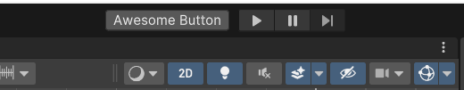
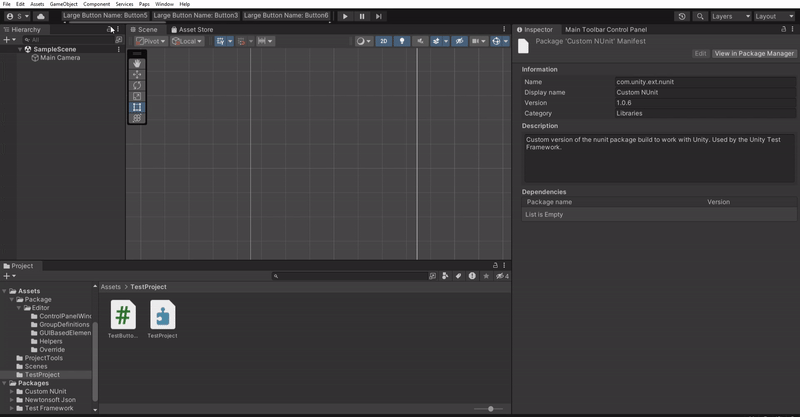
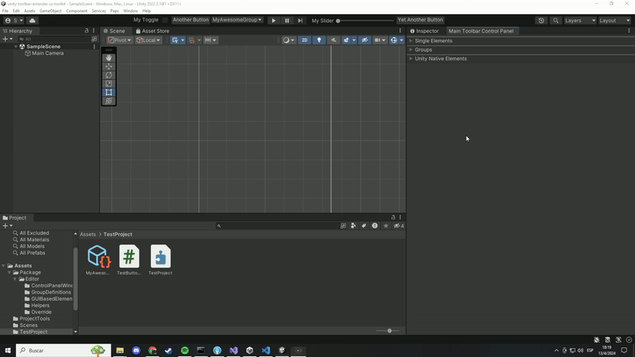

# Unity Toolbar Extender UI Toolkit

Inspired on marijnz's great [Unity Toolbar Extender](https://github.com/marijnz/unity-toolbar-extender), Unity Toolbar Extender UI Toolkit allows you to extend Unity's main toolbar (where play buttons are) using Unity's UI Toolkit.

# Getting Started

## Create common controls

Inherit from any Unity's built-in visual element, tag it with `MainToolbarElementAttribute` and define an id. You can place the script anywhere in your project.

```csharp
using Paps.UnityToolbarExtenderUIToolkit;
using UnityEngine;
using UnityEngine.UIElements;

[MainToolbarElement(id: "TheAwesomeButton")]
public class MyAwesomeButton : Button
{
    public MyAwesomeButton()
    {
        text = "Awesome Button";
        clicked += () => Debug.Log("Awesome debug");
    }
}
```



## Place them left or right to play buttons

```csharp
using Paps.UnityToolbarExtenderUIToolkit;
using UnityEngine.UIElements;

[MainToolbarElement(id: "LeftButton", ToolbarAlign.Left)]
public class MyLeftButton : Button
{
    public MyLeftButton()
    {
        text = "Left Button";
    }
}

[MainToolbarElement(id: "RightButton", ToolbarAlign.Right)]
public class MyRightButton : Button
{
    public MyRightButton()
    {
        text = "Right Button";
    }
}
```


## Arrange them

Left elements are ordered from right to left. Right elements from left to right.

```csharp
using Paps.UnityToolbarExtenderUIToolkit;
using UnityEngine.UIElements;

[MainToolbarElement(id: "FirstLeftButton", ToolbarAlign.Left, order: 1)]
public class FirstLeftButton : Button
{
    public FirstLeftButton()
    {
        text = "1st Button";
    }
}

[MainToolbarElement(id: "SecondLeftButton", ToolbarAlign.Left, order: 2)]
public class SecondLeftButton : Button
{
    public SecondLeftButton()
    {
        text = "2nd Button";
    }
}

[MainToolbarElement(id: "FirstRightButton", ToolbarAlign.Right, order: 1)]
public class FirstRightButton : Button
{
    public FirstRightButton()
    {
        text = "1st Button";
    }
}

[MainToolbarElement(id: "SecondRightButton", ToolbarAlign.Right, order: 2)]
public class SecondRightButton : Button
{
    public SecondRightButton()
    {
        text = "2nd Button";
    }
}
```


## Create more things than only buttons

```csharp
using Paps.UnityToolbarExtenderUIToolkit;
using UnityEngine.UIElements;
using System.Collections.Generic;

[MainToolbarElement(id: "AwesomeToggle", ToolbarAlign.Left)]
public class MyAwesomeToggle : Toggle
{
    public MyAwesomeToggle() : base(label: "Awesome Toggle")
    {

    }
}

[MainToolbarElement(id: "AwesomeDropdownField", ToolbarAlign.Right)]
public class MyAwesomeDropdownField : DropdownField
{
    public MyAwesomeDropdownField() : base(
        label: "Awesome Dropdown", 
        choices: new List<string>() { "Option 1", "Option 2"}, 
        defaultIndex: 0)
    {

    }
}

[MainToolbarElement(id: "AwesomeSlider", ToolbarAlign.Left)]
public class MyAwesomeSlider : Slider
{
    public MyAwesomeSlider() : base(
        label: "Awesome Slider", 
        start: 0, 
        end: 100)
    {

    }
}
```


## Create whatever visual element you want

As long as your class inherits from `VisualElement` class, you can create whatever you want.

```csharp
using Paps.UnityToolbarExtenderUIToolkit;
using UnityEngine.UIElements;

[MainToolbarElement(id: "AwesomeThing")]
public class MyAwesomeWhatever : VisualElement
{
    private Toggle _displaySliderToggle;
    private Slider _slider;

    public MyAwesomeWhatever()
    {
        _displaySliderToggle = new Toggle("Display slider");
        _slider = new Slider(0, 100);

        _displaySliderToggle.labelElement.style.minWidth = 0;

        _slider.style.display = DisplayStyle.None;
        _slider.style.minWidth = 150;

        _displaySliderToggle.RegisterCallback<ChangeEvent<bool>>(OnToggleValueChanged);

        style.minWidth = 300;
        style.flexDirection = FlexDirection.Row;

        Add(_displaySliderToggle);
        Add(_slider);
    }

    private void OnToggleValueChanged(ChangeEvent<bool> eventArgs)
    {
        var displayToggle = eventArgs.newValue;

        if (displayToggle)
            _slider.style.display = DisplayStyle.Flex;
        else
            _slider.style.display = DisplayStyle.None;
    }
}
```


## Don't worry about horizontal space. It's scrollable!



# Group your elements to save space

Create a **Group Definition** and group any visual element in it. They will be hidden and shown by a dropdown.


## Configure a Group Definition

To create a Group Definition, in Project Window, `Right Click -> Create -> Paps -> Unity Toolbar Extender UI Toolkit -> Group Definition.`

### Properties:

- `Name`: Name of the group. Acts as an id.
- `Alignment`: Left or right to play buttons
- `Order`: Order in toolbar. Left side goes from right to left. Right side goes from left to right.
- `ToolbarElementsTypes`: The types of the visual elements you want to add to this group. The order determines the order in which the inner elements will be displayed.

# Hide Unity's native toolbar visual elements. Save even more space.

Open the Main Toolbar Control Panel Window. Go to `Paps -> Unity Toolbar Extender UI Toolkit -> Windows -> Main Toolbar Control Panel`.

Hide any toolbar visual element, either Unity's or yours.



# MainToolbar Class

Everything covered in this article until now is managed by `MainToolbarAutomaticExtender` static class. If, by any chance, you don't want to manage your visual elements the way I meant, you can access the `MainToolbar` static class and manipulate Unity's main toolbar and its elements.

You can listen to `OnInitialized` event and apply your change once initialized. To subscribe to this event you need to subscribe to it before the first editor update. The easiest way is to do it in the static constructor of a class marked with `InitializeOnLoad` attribute. You can also check the `IsAvailable` property to check if it is initialized.

```csharp
using Paps.UnityToolbarExtenderUIToolkit;
using UnityEditor;

[InitializeOnLoad]
public static class MyOwnMainToolbarManager
{
    static MyOwnMainToolbarManager()
    {
        MainToolbar.OnInitialized += DoSomeStuff;
    }

    private static void DoSomeStuff()
    {
        // I do my stuff here
    }
}
```

You can access Unity's toolbar visual elements, like the play buttons container or the left (where the cloud button is) or the right (where the layouts dropdown is).

```csharp
using Paps.UnityToolbarExtenderUIToolkit;
using UnityEditor;
using UnityEditor.Toolbars;

[InitializeOnLoad]
public static class MyOwnMainToolbarManager
{
    static MyOwnMainToolbarManager()
    {
        MainToolbar.OnInitialized += DoSomeStuff;
    }

    private static void DoSomeStuff()
    {
        var myOwnPlayButton = new EditorToolbarButton("My Play Button", 
            () => EditorApplication.EnterPlaymode());

        MainToolbar.PlayModeButtonsContainer.Add(myOwnPlayButton);
    }
}
```

Unity's toolbar gets destroyed when the editor layout changes (through layout dropdown normally), when this happens `MainToolbar` class will try to get the new object. Because of this, any change made to the toolbar goes away, so you'll need to re-apply your changes. To do this, listen to `OnRefresh` event and you can the same things you did when `OnInitialized` event happened.

#    Important Miscelanous Information   

The following is a list of things I consider you might be interested in if you need to debug or understand how something works in this package:

## About Main Toolbar Elements

- Many Unity built-in visual elements, like `Button` or `DropdownField`, are rendered with a white broken texture when added to the toolbar. This package automatically applies some basic styles that kind of fix this issue. If you are looking to style your visual elements, you should read [Styling Your Main Toolbar Elements](#styling-your-main-toolbar-elements) section.
- Your visual elements will be created when your scripts are recompiled and when `MainToolbarAutomaticExtender` refreshes. Take this into account if you are doing something that is process-heavy at construction time.

## About Groups:

- Elements inside a group don't have alignment. The `Alignment` property on visual elements marked with `MainToolbarElementAttribute` will be ignored.
- Groups display their inner elements in column.
- The order the inner elements are displayed is determined by the `ToolbarElementsTypes` array elements order.

## About MainToolbar Class:

- Visual elements with `MainToolbarElementAttribute` are handled by `MainToolbarAutomaticExtender` static class. Although you could, it's not officially supported to use this feature at the same time that manipulating the `MainToolbar` class.
- Remember that Unity's `real` main toolbar object is destroyed when the layout changes. Every change made to that object goes away with it. Use `MainToolbar.OnRefresh` event to re-apply your changes.

## About MainToolbarAutomaticExtender Class:

- This is the main manager. All the magic happens inside.
- This class **WON'T** do anything, unless you mark at least one type derived from `VisualElement` with `MainToolbarElementAttribute`.

## About how this package saves its data

- This package uses EditorPrefs and json tool from Newtonsoft. A single EditorPrefs key is used to save a json object and the other classes write to this json object. If you experience some weird behaviour and you suspect it could be this cache data, you can delete it to start over. To do this go to `Paps -> Unity Toolbar Extender UI Toolkit -> Delete Actions -> Delete package related EditorPrefs`.

# Styling Your Main Toolbar Elements