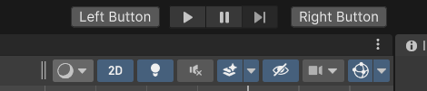

# Unity Toolbar Extender UI Toolkit

Inspired on marijnz's great [Unity Toolbar Extender](https://github.com/marijnz/unity-toolbar-extender), Unity Toolbar Extender UI Toolkit allows you to extend Unity's main toolbar using Unity's UI Toolkit.

<!-- TOC start (generated with https://github.com/derlin/bitdowntoc) -->

- [Unity Toolbar Extender UI Toolkit](#unity-toolbar-extender-ui-toolkit)
- [Install](#install)
   * [via npm](#via-npm)
   * [via OpenUPM](#via-openupm)
   * [via Git URL](#via-git-url)
- [Getting Started](#getting-started)
   * [Create Common Controls](#create-common-controls)
   * [Place Them Left or Right to Play Buttons](#place-them-left-or-right-to-play-buttons)
   * [Arrange Them](#arrange-them)
   * [Create More Things Than Only Buttons](#create-more-things-than-only-buttons)
   * [Create Whatever Visual Element You Want](#create-whatever-visual-element-you-want)
   * [Don't Worry About Horizontal Space. It's Scrollable!](#dont-worry-about-horizontal-space-its-scrollable)
   * [Important Notes](#important-notes)
- [Group Your Elements to Save Space](#group-your-elements-to-save-space)
   * [Make Subgroups](#make-subgroups)
   * [Allow Subwindows](#allow-subwindows)
   * [Important Notes](#important-notes-1)
- [Hide Unity's Native Toolbar Visual Elements. Save Even More Space](#hide-unitys-native-toolbar-visual-elements-save-even-more-space)
   * [Important Notes](#important-notes-2)
- [MainToolbar Class](#maintoolbar-class)
   * [Important Notes](#important-notes-3)
- [Styling Your Main Toolbar Elements](#styling-your-main-toolbar-elements)
- [Eligible Classes for Recommended Style Application](#eligible-classes-for-recommended-style-application)
- [Miscelaneous Information](#miscelaneous-information)
   * [About MainToolbarAutomaticExtender Class:](#about-maintoolbarautomaticextender-class)
   * [About How This Package Saves Its Data](#about-how-this-package-saves-its-data)
- [License](#license)

<!-- TOC end -->

<!-- TOC --><a name="install"></a>
# Install

<!-- TOC --><a name="via-npm"></a>
## via npm

Open `Packages/manifest.json` with your favorite text editor. Add a [scoped registry](https://docs.unity3d.com/Manual/upm-scoped.html) and following line to dependencies block:
```json
{
  "scopedRegistries": [
    {
      "name": "npmjs",
      "url": "https://registry.npmjs.org/",
      "scopes": [
        "com.paps"
      ]
    }
  ],
  "dependencies": {
    "com.paps.unity-toolbar-extender-ui-toolkit": "1.0.0"
  }
}
```
Package should now appear in package manager.

<!-- TOC --><a name="via-openupm"></a>
## via OpenUPM

The package is also available on the [openupm registry](https://openupm.com/packages/com.paps.unity-toolbar-extender-ui-toolkit). You can install it eg. via [openupm-cli](https://github.com/openupm/openupm-cli).

```
openupm add com.paps.unity-toolbar-extender-ui-toolkit
```

<!-- TOC --><a name="via-git-url"></a>
## via Git URL

Open Package Manager window, Go to `Top left plus icon -> Add package from git URL`. There add the following: `https://github.com/Sammmte/unity-toolbar-extender-ui-toolkit.git?path=/Assets/Package`

<!-- TOC --><a name="getting-started"></a>
# Getting Started

<!-- TOC --><a name="create-common-controls"></a>
## Create Common Controls

Inherit from any Unity's built-in visual element, tag it with `MainToolbarElementAttribute` and define an id. You can place the script in any `Editor` folder or subfolder or in a folder with an editor assembly definition.

```csharp
using Paps.UnityToolbarExtenderUIToolkit;
using UnityEngine;
using UnityEngine.UIElements;

[MainToolbarElement(id: "TheAwesomeButton")]
public class MyAwesomeButton : Button
{
    public MyAwesomeButton()
    {
        text = "Awesome Button";
        clicked += () => Debug.Log("Awesome debug");
    }
}
```


<!-- TOC --><a name="place-them-left-or-right-to-play-buttons"></a>
## Place Them Left or Right to Play Buttons

```csharp
using Paps.UnityToolbarExtenderUIToolkit;
using UnityEngine.UIElements;

[MainToolbarElement(id: "LeftButton", ToolbarAlign.Left)]
public class MyLeftButton : Button
{
    public MyLeftButton()
    {
        text = "Left Button";
    }
}

[MainToolbarElement(id: "RightButton", ToolbarAlign.Right)]
public class MyRightButton : Button
{
    public MyRightButton()
    {
        text = "Right Button";
    }
}
```



<!-- TOC --><a name="arrange-them"></a>
## Arrange Them

Left elements are ordered from right to left. Right elements from left to right.

```csharp
using Paps.UnityToolbarExtenderUIToolkit;
using UnityEngine.UIElements;

[MainToolbarElement(id: "FirstLeftButton", ToolbarAlign.Left, order: 1)]
public class FirstLeftButton : Button
{
    public FirstLeftButton()
    {
        text = "1st Button";
    }
}

[MainToolbarElement(id: "SecondLeftButton", ToolbarAlign.Left, order: 2)]
public class SecondLeftButton : Button
{
    public SecondLeftButton()
    {
        text = "2nd Button";
    }
}

[MainToolbarElement(id: "FirstRightButton", ToolbarAlign.Right, order: 1)]
public class FirstRightButton : Button
{
    public FirstRightButton()
    {
        text = "1st Button";
    }
}

[MainToolbarElement(id: "SecondRightButton", ToolbarAlign.Right, order: 2)]
public class SecondRightButton : Button
{
    public SecondRightButton()
    {
        text = "2nd Button";
    }
}
```


<!-- TOC --><a name="create-more-things-than-only-buttons"></a>
## Create More Things Than Only Buttons

```csharp
using Paps.UnityToolbarExtenderUIToolkit;
using UnityEngine.UIElements;
using System.Collections.Generic;

[MainToolbarElement(id: "AwesomeToggle", ToolbarAlign.Left)]
public class MyAwesomeToggle : Toggle
{
    public MyAwesomeToggle() : base(label: "Awesome Toggle")
    {

    }
}

[MainToolbarElement(id: "AwesomeDropdownField", ToolbarAlign.Right)]
public class MyAwesomeDropdownField : DropdownField
{
    public MyAwesomeDropdownField() : base(
        label: "Awesome Dropdown", 
        choices: new List<string>() { "Option 1", "Option 2"}, 
        defaultIndex: 0)
    {

    }
}

[MainToolbarElement(id: "AwesomeSlider", ToolbarAlign.Left)]
public class MyAwesomeSlider : Slider
{
    public MyAwesomeSlider() : base(
        label: "Awesome Slider", 
        start: 0, 
        end: 100)
    {

    }
}

[MainToolbarElement("MyAwesomeIntField", ToolbarAlign.Right)]
public class MyAwesomeIntegerField : IntegerField
{
    public MyAwesomeIntegerField() : base("My Awesome Int")
    {

    }
}
```


<!-- TOC --><a name="create-whatever-visual-element-you-want"></a>
## Create Whatever Visual Element You Want

As long as your class inherits from `VisualElement` class, you can create whatever you want.

```csharp
using Paps.UnityToolbarExtenderUIToolkit;
using UnityEngine.UIElements;

[MainToolbarElement(id: "AwesomeThing")]
public class MyAwesomeWhatever : VisualElement
{
    private Toggle _displaySliderToggle;
    private Slider _slider;

    public MyAwesomeWhatever()
    {
        _displaySliderToggle = new Toggle("Display slider");
        _slider = new Slider(0, 100);

        _displaySliderToggle.labelElement.style.minWidth = 0;

        _slider.style.display = DisplayStyle.None;
        _slider.style.minWidth = 150;

        _displaySliderToggle.RegisterCallback<ChangeEvent<bool>>(OnToggleValueChanged);

        style.minWidth = 300;
        style.flexDirection = FlexDirection.Row;

        Add(_displaySliderToggle);
        Add(_slider);
    }

    private void OnToggleValueChanged(ChangeEvent<bool> eventArgs)
    {
        var displayToggle = eventArgs.newValue;

        if (displayToggle)
            _slider.style.display = DisplayStyle.Flex;
        else
            _slider.style.display = DisplayStyle.None;
    }
}
```


<!-- TOC --><a name="dont-worry-about-horizontal-space-its-scrollable"></a>
## Don't Worry About Horizontal Space. It's Scrollable!


<!-- TOC --><a name="important-notes"></a>
## Important Notes

- If you want to apply custom style to your elements, please read [Styling Your Main Toolbar Elements](#styling-your-main-toolbar-elements) section.
- You can define a main toolbar element that inherits from `IMGUIContainer` to render stuff with `IMGUI`. Remember to use `GUILayout.BeginHorizontal` and `GUILayout.EndHorizontal` to render your things in row.

<!-- TOC --><a name="group-your-elements-to-save-space"></a>
# Group Your Elements to Save Space

Create a **Group Definition** and group any visual element in it. They will be hidden and shown by a dropdown.


<!-- TOC --><a name="make-subgroups"></a>
## Make Subgroups

When configuring `ToolbarElementsIds` property in your group definition asset, add a new element and select the id of other group asset.


<!-- TOC --><a name="allow-subwindows"></a>
## Allow Subwindows

Group elements display a small window that works almost like a popup window. If your custom element displays a window, by default the group element window will be closed. To tell group element window that your window is a subwindow mark your `EditorWindow` derived class with  `GroupPopupSubWindowAttribute`. This attribute can also be used with classes derived from `PopupWindowContent`.

Example with `EditorWindow`

```csharp
using Paps.UnityToolbarExtenderUIToolkit;
using UnityEditor;
using UnityEditor.Toolbars;
using UnityEngine;
using UnityEngine.UIElements;

[MainToolbarElement("MyDropdownWithWindow")]
public class DropdownInGroupWithWindow : EditorToolbarDropdown
{
    public DropdownInGroupWithWindow()
    {
        text = nameof(DropdownInGroupWithWindow);
        clicked += ShowDropdownWindow;
    }

    private void ShowDropdownWindow()
    {
        var newWindowDropdown = ScriptableObject.CreateInstance<DropdownWindow>();
        newWindowDropdown.ShowAsDropdownForMainToolbar(worldBound, new Vector2(200, 200));
    }
}

[GroupPopupSubWindow]
public class DropdownWindow : EditorWindow
{
    private void CreateGUI()
    {
        var debugButton = new Button(() => Debug.Log("What a debug!"));
        debugButton.text = "Debug";

        var closeButton = new Button(() => Close());
        closeButton.text = "Close";

        rootVisualElement.Add(debugButton);
        rootVisualElement.Add(closeButton);
    }
}
```

Example with `PopupWindowContent`

```csharp
using Paps.UnityToolbarExtenderUIToolkit;
using UnityEditor;
using UnityEditor.Toolbars;
using UnityEngine;
using UnityEngine.UIElements;

[MainToolbarElement("MyDropdownWithPopupWindowContent")]
public class DropdownInGroupWithPopupWindow : EditorToolbarDropdown
{
    public DropdownInGroupWithPopupWindow()
    {
        text = nameof(DropdownInGroupWithPopupWindow);
        clicked += ShowPopupWindow;
    }

    private void ShowPopupWindow()
    {
        UnityEditor.PopupWindow.Show(worldBound, new PopupWindowContentThatWorksInASubgroup());
    }
}

[GroupPopupSubWindow]
public class PopupWindowContentThatWorksInASubgroup : PopupWindowContent
{
    public override void OnOpen()
    {
        var debugButton = new Button(() => Debug.Log("What a debug!"));
        debugButton.text = "Debug";

        var closeButton = new Button(() => editorWindow.Close());
        closeButton.text = "Close";

        editorWindow.rootVisualElement.Add(debugButton);
        editorWindow.rootVisualElement.Add(closeButton);
    }

    public override void OnGUI(Rect rect)
    {
        
    }
}
```


<!-- TOC --><a name="important-notes-1"></a>
## Important Notes

- Elements inside a group don't have alignment. The `Alignment` property on visual elements marked with `MainToolbarElementAttribute` will be ignored.
- Groups display their inner elements in column.
- The order the inner elements are displayed is determined by the `ToolbarElementsIds` array elements order.
- Group popup windows won't close if focused window is `UI Toolkit Debugger`, so you can analyze your elements inside these windows.

<!-- TOC --><a name="hide-unitys-native-toolbar-visual-elements-save-even-more-space"></a>
# Hide Unity's Native Toolbar Visual Elements. Save Even More Space

Open the Main Toolbar Control Panel Window. Go to `Paps -> Unity Toolbar Extender UI Toolkit -> Windows -> Main Toolbar Control Panel`.

Hide any toolbar visual element, either Unity's or yours.


<!-- TOC --><a name="important-notes-2"></a>
## Important Notes

- `MainToolbarAutomaticExtender` hides visual elements by settings their style property `display` to `Display.None`.
- There are 2 exceptions to the previous rule, Unity's `AccountDropdown` and `CloudButton` elements. These 2 elements can't be hidden by modifying `display` property, so the way this package hides them is by removing them from the hierarchy.
- If you want to reset these overrides, go to `Paps -> Unity Toolbar Extender UI Toolkit -> Delete Actions -> Reset Overrides`.

<!-- TOC --><a name="maintoolbar-class"></a>
# MainToolbar Class

Everything covered in this article until now is managed by `MainToolbarAutomaticExtender` static class. If, by any chance, you don't want to manage your visual elements the way I meant, you can access the `MainToolbar` static class and manipulate Unity's main toolbar and its elements.

You can listen to `OnInitialized` event and apply your changes once initialized. To subscribe to this event you need to subscribe to it before the first editor update. The easiest way is to do it in the static constructor of a class marked with `InitializeOnLoad` attribute. You can also check the `IsAvailable` property to check if it is initialized.

```csharp
using Paps.UnityToolbarExtenderUIToolkit;
using UnityEditor;

[InitializeOnLoad]
public static class MyOwnMainToolbarManager
{
    static MyOwnMainToolbarManager()
    {
        MainToolbar.OnInitialized += DoSomeStuff;
    }

    private static void DoSomeStuff()
    {
        // I do my stuff here
    }
}
```

You can access Unity's toolbar visual elements, like the play buttons container or the left (where the cloud button is) or the right (where the layouts dropdown is).

```csharp
using Paps.UnityToolbarExtenderUIToolkit;
using UnityEditor;
using UnityEditor.Toolbars;

[InitializeOnLoad]
public static class MyOwnMainToolbarManager
{
    static MyOwnMainToolbarManager()
    {
        MainToolbar.OnInitialized += DoSomeStuff;
    }

    private static void DoSomeStuff()
    {
        var myOwnPlayButton = new EditorToolbarButton("My Play Button", 
            () => EditorApplication.EnterPlaymode());

        MainToolbar.PlayModeButtonsContainer.Add(myOwnPlayButton);
    }
}
```

Unity's toolbar gets destroyed when the editor layout changes (through layout dropdown normally). When this happens `MainToolbar` class will try to get the new object. Because of this, any change made to the toolbar goes away, so you'll need to re-apply your changes. To do this, listen to `OnRefresh` event and you can do the same things you did when `OnInitialized` event happened.

<!-- TOC --><a name="important-notes-3"></a>
## Important Notes

- Visual elements with `MainToolbarElementAttribute` are handled by `MainToolbarAutomaticExtender` static class. Although you could, it's not officially supported to use this feature at the same time that manipulate the `MainToolbar` class.

<!-- TOC --><a name="styling-your-main-toolbar-elements"></a>
# Styling Your Main Toolbar Elements

Some common built-in visual elements have some issues when added to the toolbar containers (e.g `Button` and `DropdownField` that are rendered with a white broken-like texture), and some other when they are added to the group element window (e.g `EditorToolbarDropdown` that doesn't render its foldout arrow).

Check this example.


To workaround this, `MainToolbarAutomaticExtender` applies some changes to style of most of your custom visual elements when they are added either to toolbar containers or to group element windows.

Because of this, if you want to style your custom visual elements yourself you should set `MainToolbarElementAttribute` parameter `useRecommendedStyles` to `false`. Otherwise, your overrides might collide with extender's overrides. You can check if your class will be styled with recommended styles in [this list](#eligible-classes-for-recommended-style-application).

```csharp
using Paps.UnityToolbarExtenderUIToolkit;
using UnityEngine.UIElements;

[MainToolbarElement(id: "StyledButton", useRecommendedStyles: false)]
public class MyStyledButton : Button
{
    public MyStyledButton()
    {
        // I change the style of my button here
    }
}
```

<!-- TOC --><a name="eligible-classes-for-recommended-style-application"></a>
# Eligible Classes for Recommended Style Application

If your custom main toolbar element meets at least one of the following criteria, it will be eligible to be styled with recommended styles:

- Inherits from `Button` and does not inherits from `EditorToolbarButton`
- Inherits from `Toggle` and does not inherits from `EditorToolbarToggle`
- Inherits from `Slider`
- Inherits from `DropdownField`
- Inherits from `EditorToolbarDropdown`
- Inherits from `IntegerField`
- Inherits from `FloatField`
- Inherits from `TextField`

Remember that you can disable this feature by setting `useRecommendedStyles` to `false` in `MainToolbarElementAttribute` constructor.

<!-- TOC --><a name="miscelaneous-information"></a>
# Miscelaneous Information

<!-- TOC --><a name="about-maintoolbarautomaticextender-class"></a>
## About MainToolbarAutomaticExtender Class:

- This is the main manager. Most of the magic happens inside.
- This class **WON'T** do anything, unless you mark at least one type derived from `VisualElement` with `MainToolbarElementAttribute`.
- When this manager initializes it applies some changes to style of native containers of Unity's main toolbar. This means that those containers behave in a way when `MainToolbarAutomaticExtender` is initialized and other way when it is not.

<!-- TOC --><a name="about-how-this-package-saves-its-data"></a>
## About How This Package Saves Its Data

- This package uses EditorPrefs and json tool from Newtonsoft. A single EditorPrefs key is used to save a json object and the other classes write to this json object. If you experience some weird behaviour and you suspect it could be this cache data, you can delete it to start over. To do this go to `Paps -> Unity Toolbar Extender UI Toolkit -> Delete Actions -> Delete package related EditorPrefs`.

<!-- TOC --><a name="license"></a>
# License

MIT LICENSE
        